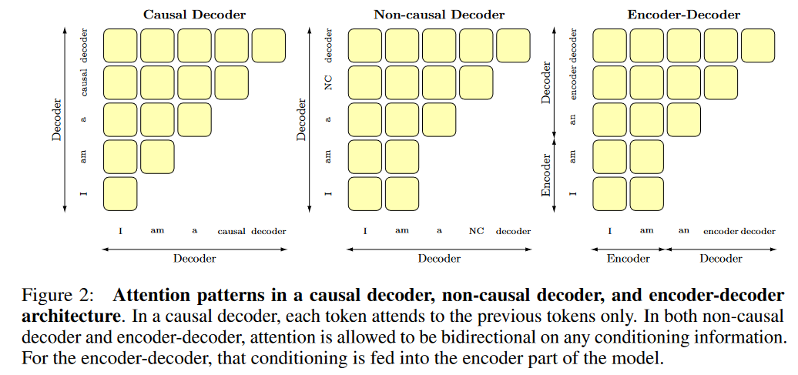

## N-shot learning

_N-shot learning_ est une technique de [prompt](#prompt). Pour réaliser une tâche spécifique, N exemples sont pourvus dans le prompt, avec la requête de l’utilisateur.

En particulier, le zero-shot learning vise à réaliser la tâche demandée en fournissant seulement les instructions nécessaires, sans exemple

Le few-shot learning consiste à donner quelques exemples dans le contexte. Ces techniques se rapprochent de ce que nous, humains, utilisons pour expliquer une nouvelle tâche à quelqu’un.

Cette notion était ambiguë jusqu’à ce qu’OpenAI propose une définition commune dans le papier de GPT3.

Exemple:

Voici un prompt de 1-shot learning “Infirmier → infirmière ; boulanger → “

Références:
- Page wikipedia https://en.wikipedia.org/wiki/In-context_learning_(natural_language_processing) 
- GPT3 : Language Models are Few-Shot Learners https://arxiv.org/abs/2005.14165 

## Prompt

Un _prompt_ est une chaîne de caractères passée en input d’un modèle. Il regroupe les informations et/ou instructions nécessaires à la réalisation de la tâche ainsi que des informations additionnelles pour l’aider à comprendre sa tâche.

Exemple:

- “Traduire la phrase suivante en français : Linagora is a good company. → “
- “Mettre au pluriel les mots suivants : chien → chiens ; chat → chats ; cheval → “

Certains modèles sont entraînés sur des jeux de données déjà promptés pour des tâches spécifiques. Dans ces cas-là, pour réaliser ces tâches, il peut être plus efficace de reprendre la même structure de prompt.

Exemple:

T5 est fine-tuné pour plusieurs tâches (multitask finetuning), dont la summarization. Ainsi, si l'on veut lui soumettre un texte à résumer, il suffit d'utiliser le prompt "summarize: " suivi du texte.

Références:
- Guiding Large Language Models towards Task-Specific Inference - Prompt Design and Soft Prompts https://towardsdatascience.com/guiding-a-huge-language-model-lm-to-perform-specific-tasks-prompt-design-and-soft-prompts-7c45ef4794e4
- T5 Exploring the Limits of Transfer Learning with a Unified Text-to-Text Transformer : https://arxiv.org/abs/1910.10683

## Causal language modeling

C'est un type de modèle de langage qui s'applique aux transformers de type decoder-only. On considère une séquence de tokens placée en input d'un modèle de ce type. Pour un token donné, le processus d'attention fait uniquement référence à tous les tokens qui le précèdent. 

GPT d'OpenAI appartient à ce type de modèles de langage.

Références:
- UL2: Unifying Language Learning Paradigms : https://arxiv.org/abs/2205.05131
- What Language Model Architecture and Pretraining Objective Work Best for Zero-Shot Generalization? : https://arxiv.org/abs/2204.05832

## Hallucination

L'hallucination est une réponse confiante produite par le modèle d'IA, qui peut patraître correcte, mais qui n'est pas justifiée par ses données d'entraînement.

Cette définition peut être choisie plus ou moins stricte. Par exemple, dans le domaine du résumé automatique de texte, une hallucination peut aussi désigner le fait que le modèle rajoute des éléments au résumé qui ne figurent pas dans le texte.

Exemples imaginaires :
- On fournit l'input suivant "Quand est né Napoléon ?" et l'output est "Napoléon est né en 2087 en Corse."
- On fournit l'input suivant "Résumer la phrase suivante. Emmanuel Macron a donné ce matin de nouveaux éléments sur la question de la réforme des retraites, dont les contours semblent se préciser." et l'output est "Emmanuel Macron, invité ce matin *à France Inter*, a précisé le contenu de la réforme des retraites."

Références:
- Wikipédia Hallucination https://en.wikipedia.org/wiki/Hallucination_(artificial_intelligence)
- How to Reduce the Hallucinations from Large Language Models : https://thenewstack.io/how-to-reduce-the-hallucinations-from-large-language-models/

## Generative Pre-Trained Transformer/Decoder-only model

Generative Pre-Trained Transformer (GPT) fait référence à une famille de [transformeurs](#transformer), au-delà des modèles développés par OpenAI. Ces modèles ont une structure de decoder-only et sont des [Causal Language Models](#causal-language-modeling). L'objectif de pré-entraînement est la prédiction du token suivant (next token prediction). Cela leur permet à partir d'un contexte donné de générer une séquence de tokens en rajoutant à chaque fois le dernier token généré à l'input.

Références:
- Wikipédia GPT : https://en.wikipedia.org/wiki/Generative_pre-trained_transformer

## Attention

C'est un mécanisme utilisé pour représenter les liens relatifs entre les tokens d'un input et leur importance, dans la structure des modèles. Ainsi, la représentation vectorielle de chaque token prend en compte son contexte.

Concrètement, ce sont plusieurs couches supplémentaires qui sont placées dans la structure du [transformeur](#transformer), et dont les paramètres sont entraînés.

Références:
- Attention is all you need : https://arxiv.org/abs/1706.03762
- Visualizing A Neural Machine Translation Model (Mechanics of Seq2seq Models With Attention) : https://jalammar.github.io/visualizing-neural-machine-translation-mechanics-of-seq2seq-models-with-attention/

## GPU

Un GPU (Graphics Processing Unit) est un processeur composé de nombreux coeurs, plus petits et plus spécialisé qu'un CPU (Central Processing Unit). Le GPU permet de facilement paralléliser les calculs, ce qui est particulièrement intéressant pour entraîner les transformeurs.

Au GPU est associé la VRAM (Video Random Access Memory), mémoire vive qui permet notamment de stocker les valeurs des paramètres du modèle de langage pendant le calcul. 

## Quantization

La quantization facilite les calculs au moment de l'inférence ou lors de l'entraînement. Les valeurs des paramètres sont approchées par une représentation de nombres moins volumineuse, ces approximations sont utilisées pour le calcul puis stockées. Cela réduit les exigences en terme de mémoire vive.

On peut mentionner l'algorithme 8-bit optimizer, qui permet de diminuer par 4 les besoins en mémoire vive si les valeurs des paramètres sont codées sur 32 bits, en perdant relativement peu de performance de prédiction.

Ressources:
- Présentation de la bibliothèque bitsandbytes pour la quantization : https://huggingface.co/blog/hf-bitsandbytes-integration
- Tutoriel OpenLLM France pour le finetuning avec qLoRA : https://colab.research.google.com/github/OpenLLM-France/Tutoriel/blob/main/01_qlora_fine_tuning.ipynb